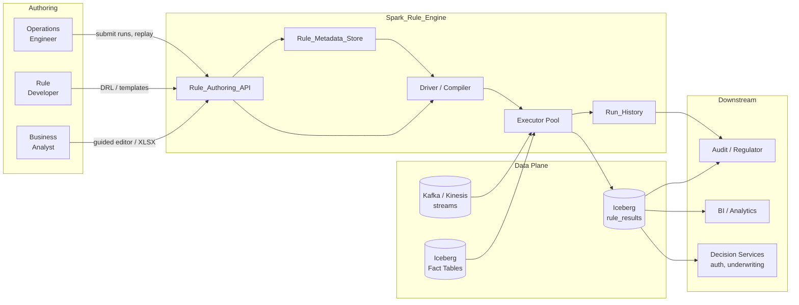
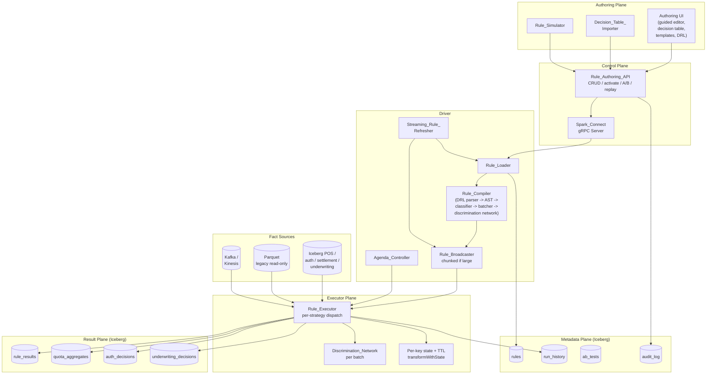
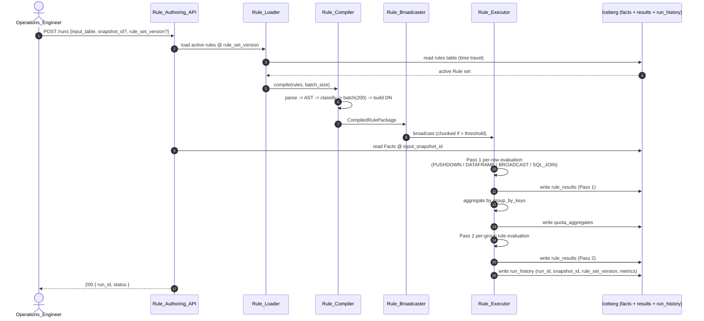
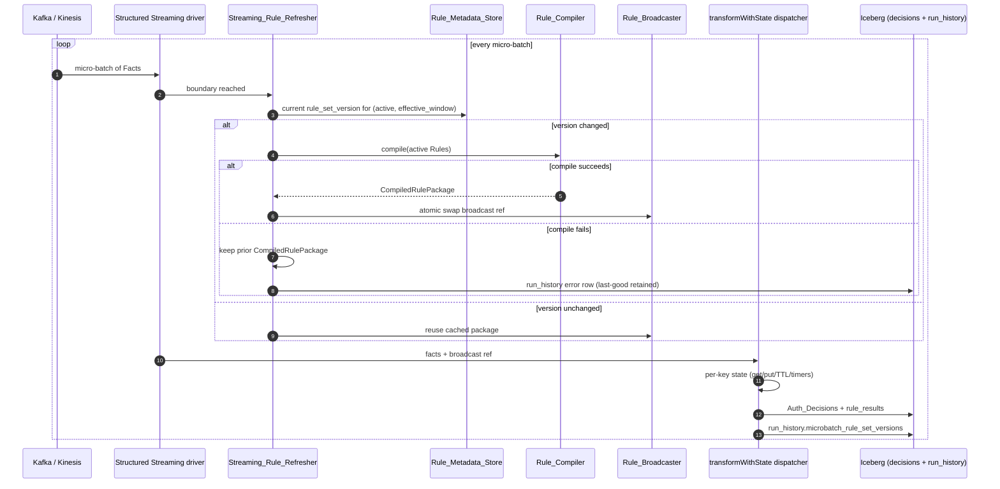
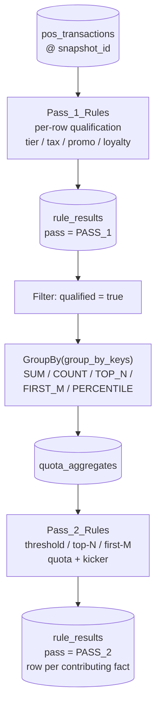
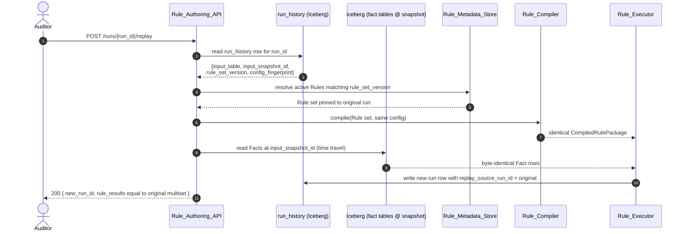
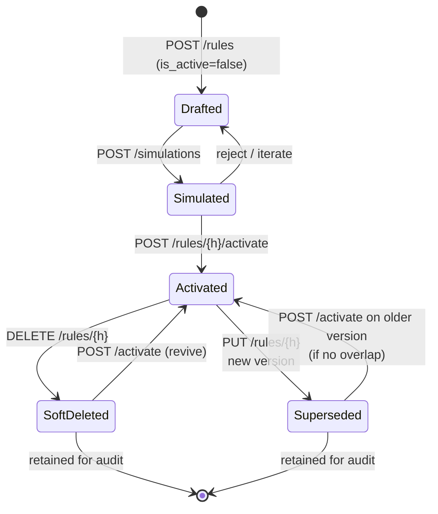

# sparkrules

SparkRules—this system combines the sophisticated logic of a rule engine (similar to Drools) with the horizontal scalability of Apache Spark. It targets intricate business logic over large batch or streaming workloads with high throughput.

## Documentation index (read this first)

| Role | Where to start |
|------|----------------|
| **Developer / contributor** | [`BUILD_STATUS.md`](BUILD_STATUS.md) for current test gates. Install: `pip install -e ".[test]"`. Run: `pytest tests/ -q` (expect **234 passed, 1 deselected**). Code: `src/sre/`. |
| **QA / automation** | Default suite excludes perf; run `pytest tests/perf -m perf -q` for the benchmark. Property tests: `tests/property/` (P1–P38). Integration: `tests/integration/`. |
| **Product, BA, compliance** | **## Glossary** and **## Requirements** below for domain language and acceptance criteria. Diagrams: **## Architecture Overview**. |
| **Platform / SRE** | `deploy/k8s/` for sample manifests. This repository is a **Python reference** implementation; the full distributed stack is specified here, not all of it is wired to a live cluster in-tree. |

**Phase 1 complete (per `idea-brainstrom.txt` §8–9, §34.2):** test counts in `BUILD_STATUS.md`; properties P1–P38 in `tests/property/`; extended example coverage in `tests/unit/test_requirement_ladder.py`. Build gates and later phases: root **`idea-brainstrom.txt`**.

**Note on `.kiro/` specs:** The blueprint may reference `.kiro/specs/.../requirements.md`. That path is not present in this repository; **this README** (from **## Glossary** onward) is the authoritative requirements text for the Phase 1 reference build, reviewed against the implementation and tests for the “all done” gate.

# Requirements Document

## Introduction

The Spark_Rule_Engine is a distributed, Drools-equivalent business rule engine built on Apache Spark 4 for evaluating thousands of configurable business rules against billions of transactions. The engine combines a hybrid execution model (broadcast-based pattern matching, DataFrame-native evaluation, SQL join-based matching, and predicate pushdown) with a versioned rule metadata store, streaming dynamic rule updates, and multi-layered authoring interfaces for business and technical users. It supports both batch and streaming deployment modes and targets three workload families: (1) legacy Point-of-Sale modernization requiring per-row rule evaluation plus post-aggregation quota and tiered-discount rules over billions of POS_Transaction rows per run, (2) credit card processing spanning low-latency authorization streaming, end-of-cycle balance and settlement batch, and application underwriting with thousands of rules per decision, and (3) general-purpose enterprise rule evaluation such as fraud analysis, compliance checking, and pricing. Facts, rule results, and run history are stored in an open table format (Apache Iceberg) to provide ACID transactions, schema evolution, time travel, and row-level deletes required for audit, replay, and correction of billion-row workloads.

## Glossary

- **Spark_Rule_Engine**: The complete distributed rule evaluation system built on Apache Spark 4.
- **Rule_Compiler**: The driver-side component that parses rule definitions and compiles them into executable predicates and actions.
- **Rule_Executor**: The executor-side component that evaluates compiled rules against fact partitions.
- **Rule_Metadata_Store**: The versioned persistent store holding rule definitions, metadata, and lifecycle information.
- **Rule_Authoring_API**: The REST interface for creating, reading, updating, and deleting rules.
- **Rule_Broadcaster**: The component that distributes compiled rules from driver to executors via Spark broadcast variables.
- **Rule_Simulator**: The component that evaluates proposed rules against sample fact data without persisting results.
- **Rule_Loader**: The component that loads active rules from the Rule_Metadata_Store for an evaluation run.
- **DRL_Parser**: The parser for Drools Rule Language equivalent syntax.
- **Decision_Table_Importer**: The component that imports decision tables from XLS/XLSX spreadsheets.
- **Agenda_Controller**: The component that orders and partitions rule activations by agenda group and salience.
- **Streaming_Rule_Refresher**: The component that refreshes broadcast rules at micro-batch boundaries in streaming mode.
- **Fact**: A single input record (e.g., a transaction) evaluated by rules.
- **Rule**: A versioned object containing conditions and actions, with metadata including rule_id, version, rule_group, salience, effective_from, effective_to, is_active, rule_definition, and activation_group.
- **Rule_Handle**: A stable identifier used to reference a rule across versions.
- **Rule_Group**: A named collection of rules that can be evaluated together (analogous to a Drools agenda group).
- **Activation_Group**: A set of rules in which at most one rule fires per fact (mutual exclusion).
- **Salience**: A numeric priority used to order rule activation within a group.
- **Hit_Policy**: A decision-table policy controlling how multiple matching rows combine (e.g., Unique, First, Priority, Collect).
- **Rule_Batch**: A group of approximately 200 rules compiled and evaluated together to balance codegen size and throughput.
- **Discrimination_Network**: A Rete-style shared predicate network that evaluates common sub-expressions once per fact.
- **Catalyst**: The Spark SQL query optimizer.
- **Spark_Connect**: The gRPC-based Spark client/server protocol separating authoring from execution.
- **VARIANT**: The Spark 4 semi-structured data type used to store flexible rule definitions.
- **transformWithState**: The Spark Structured Streaming API used for stateful rule evaluation with timers and TTLs.
- **Pass_1_Rule**: A per-row Rule evaluated against each Fact independently in the first evaluation pass, producing a classification, qualification flag, or per-row derived values (e.g., line-item discount, eligibility marker).
- **Pass_2_Rule**: A Rule evaluated in the second pass against aggregated results of Pass_1_Rule outputs, operating on grouped or summarized Facts rather than individual rows.
- **Aggregate_Rule**: A Rule whose conditions reference aggregate functions (SUM, COUNT, MIN, MAX, AVG, TOP_N, PERCENTILE) over a group_by key set, evaluated during Pass 2.
- **Quota_Rule**: An Aggregate_Rule that grants or withholds an action (e.g., tier discount, kicker discount, promo price) when an aggregated measure crosses a threshold or ranks within a top-N or first-M window per group key.
- **POS_Transaction**: A legacy Point-of-Sale Fact record, potentially arriving as a flat wide schema from mainframe or legacy extracts, containing line-item and basket-level fields (store_id, region_id, customer_id, campaign_id, sku, quantity, price, tax, loyalty fields).
- **Auth_Decision**: The deterministic output of credit card authorization rule evaluation for a single transaction, taking one of the values approve, decline, or step-up, accompanied by reason codes.
- **Settlement_Record**: A Fact representing an end-of-day settlement line item subject to interchange, chargeback, and network fee rules during batch reconciliation.
- **Underwriting_Application**: A Fact representing a credit card application evaluated by thousands of Rules covering KYC, risk tier, credit limit assignment, and product eligibility.
- **Iceberg_Table**: An Apache Iceberg table used as the primary open table format for Facts, Rule_Results, and Run_History, providing ACID transactions, schema evolution, hidden partitioning, snapshot isolation, time travel, and row-level deletes over Parquet data files.
- **Snapshot_Id**: An Apache Iceberg snapshot identifier uniquely naming a point-in-time state of an Iceberg_Table, used to pin inputs for reproducible and replayable evaluation runs.
- **Reason_Code**: A stable short identifier emitted alongside a rule match that names the semantic reason a Rule fired on a Fact, used in credit card underwriting and regulatory explainability outputs.

## Architecture Overview

The diagrams below summarize the system structure, the batch and streaming
execution sequences, the two-pass quota evaluation flow, and the replay
semantics referenced throughout the Requirements section. Full architectural
detail is in `design.md`; these diagrams are provided so each requirement can
be read in context of the component it constrains.

### C1 — System Context

### C2 — Component Decomposition

### S1 — Batch Evaluation Sequence

### S2 — Streaming Evaluation with Dynamic Rule Refresh

### S3 — Two-Pass Quota (POS End-of-Day)

Invariants visible in the diagram:
- Pass_2 aggregation input is exactly the Pass-1-qualified Fact subset
  (Requirement 26.6, Property P28).
- Pass_2 rule_results commit after all Pass_1 rule_results commit
  (Requirement 26.5, Property P29).

### S4 — Snapshot-Pinned Replay

Invariant: rule_results multiset of the replay equals that of the original
run (Requirement 33.3, Property P36).

### S5 — Rule Authoring Lifecycle

Every transition is recorded in audit_log with timestamp, principal, and
request hash (Requirement 1.7, Requirement 34.4).

## Requirements

### Requirement 1: Rule Definition and Metadata Storage

**User Story:** As a rule author, I want to persist rule definitions with versioned metadata, so that rules can be managed, audited, and activated independently of code deployments.

#### Acceptance Criteria

1. THE Rule_Metadata_Store SHALL persist each Rule with the fields rule_id, version, rule_group, salience, effective_from, effective_to, is_active, rule_definition, and activation_group.
2. THE Rule_Metadata_Store SHALL store rule_id as a UUID.
3. THE Rule_Metadata_Store SHALL store rule_definition using the Spark 4 VARIANT type.
4. WHEN a Rule is updated, THE Rule_Metadata_Store SHALL create a new version record and retain all prior versions.
5. WHEN a Rule is queried by rule_handle without a version, THE Rule_Metadata_Store SHALL return the highest version whose is_active is true and whose current time falls within effective_from and effective_to inclusive.
6. IF two Rules share the same rule_handle and overlapping effective date ranges with is_active true, THEN THE Rule_Metadata_Store SHALL reject the later write with a conflict error.
7. WHEN a Rule write is accepted, THE Rule_Metadata_Store SHALL record the write timestamp and the authoring principal.

### Requirement 2: Rule Authoring REST API

**User Story:** As a rule administrator, I want a REST API for rule CRUD operations, so that rules can be managed programmatically and integrated with external tooling.

#### Acceptance Criteria

1. THE Rule_Authoring_API SHALL expose endpoints for creating, reading, updating, deleting, listing, and activating Rules.
2. WHEN a create request contains a syntactically valid rule_definition, THE Rule_Authoring_API SHALL persist the Rule and return the assigned rule_id and version.
3. IF a create or update request contains a rule_definition that fails DRL_Parser validation, THEN THE Rule_Authoring_API SHALL reject the request with HTTP 400 and a parser diagnostic identifying the offending line and column.
4. WHEN a delete request targets a Rule, THE Rule_Authoring_API SHALL set is_active to false and retain the record for audit rather than physically deleting it.
5. WHEN a list request is received with filters for rule_group, activation_group, or is_active, THE Rule_Authoring_API SHALL return only Rules matching all provided filters.
6. IF an authenticated principal lacks authorization for a requested operation, THEN THE Rule_Authoring_API SHALL reject the request with HTTP 403.

### Requirement 3: DRL-Equivalent Rule Syntax and Parser

**User Story:** As an advanced rule author, I want a DRL-equivalent textual syntax, so that I can express complex patterns familiar from Drools.

#### Acceptance Criteria

1. THE DRL_Parser SHALL accept rule definitions containing rule name, salience, agenda-group, activation-group, when (conditions), and then (actions) sections.
2. WHEN a rule_definition is parsed, THE DRL_Parser SHALL produce an abstract syntax tree usable by the Rule_Compiler.
3. IF a rule_definition contains unresolved identifiers, THEN THE DRL_Parser SHALL return an error naming each unresolved identifier.
4. THE Spark_Rule_Engine SHALL provide a pretty printer that serializes a parsed rule abstract syntax tree back into DRL-equivalent text.
5. FOR ALL valid rule_definition inputs, parsing the input to an abstract syntax tree, pretty printing the tree, and parsing the result SHALL produce an abstract syntax tree equivalent to the first (round-trip property).

### Requirement 4: Guided Decision Tables with Hit Policies

**User Story:** As a business user, I want to author rules using guided decision tables with hit policies, so that I can express decision logic without learning a textual syntax.

#### Acceptance Criteria

1. THE Spark_Rule_Engine SHALL allow business users to create decision tables with input columns, output columns, and rows through a guided editor.
2. THE Spark_Rule_Engine SHALL support the hit policies Unique, First, Priority, and Collect.
3. WHEN a decision table is saved, THE Spark_Rule_Engine SHALL compile the decision table into one or more Rules stored in the Rule_Metadata_Store.
4. IF a decision table declares hit policy Unique and contains rows with overlapping input conditions, THEN THE Spark_Rule_Engine SHALL reject the save with a validation error identifying the overlapping rows.
5. WHEN a Fact is evaluated against a decision table with hit policy First, THE Spark_Rule_Engine SHALL return the output of the first row whose conditions match in row order.

### Requirement 5: Spreadsheet Decision Table Import

**User Story:** As a business analyst, I want to import decision tables from XLS and XLSX spreadsheets, so that I can reuse existing spreadsheet-based rule catalogs.

#### Acceptance Criteria

1. THE Decision_Table_Importer SHALL accept files with extensions .xls and .xlsx.
2. WHEN a spreadsheet is imported, THE Decision_Table_Importer SHALL produce decision tables equivalent to the guided decision table model.
3. IF an imported spreadsheet contains cells that fail type validation against the declared column types, THEN THE Decision_Table_Importer SHALL reject the import and return the list of offending cells with sheet, row, and column references.
4. WHEN a spreadsheet import succeeds, THE Decision_Table_Importer SHALL persist the source file hash alongside the generated Rules for traceability.

### Requirement 6: Guided Rule Editors and Templates

**User Story:** As a business user, I want guided rule editors and reusable templates, so that I can create rules consistently without writing DRL.

#### Acceptance Criteria

1. THE Spark_Rule_Engine SHALL provide a guided rule editor that constructs when and then clauses from selectable fact types, fields, operators, and values.
2. THE Spark_Rule_Engine SHALL provide rule templates parameterized by named placeholders.
3. WHEN a rule template is instantiated with a complete set of placeholder values, THE Spark_Rule_Engine SHALL produce a Rule whose rule_definition is equivalent to the corresponding DRL form.
4. IF a rule template is instantiated with missing placeholder values, THEN THE Spark_Rule_Engine SHALL reject the instantiation and list the missing placeholders.

### Requirement 7: Pattern Matching and Chaining

**User Story:** As a rule author, I want pattern matching with forward and backward chaining, so that I can express multi-fact rules and derived conclusions.

#### Acceptance Criteria

1. THE Rule_Executor SHALL support pattern matching across multiple Fact types within a single Rule.
2. THE Rule_Executor SHALL support forward chaining such that facts asserted by a Rule action are available to subsequent Rule evaluations within the same evaluation cycle.
3. THE Rule_Executor SHALL support backward chaining such that a goal query triggers evaluation of Rules whose conclusions satisfy the goal.
4. WHEN forward chaining produces no new facts in an iteration, THE Rule_Executor SHALL terminate the evaluation cycle.
5. IF forward chaining exceeds a configured maximum iteration count, THEN THE Rule_Executor SHALL terminate the cycle and report a chaining-limit-exceeded error with the last iteration count.

### Requirement 8: Salience and Agenda Group Ordering

**User Story:** As a rule author, I want to control rule firing order using salience and agenda groups, so that higher-priority rules fire before lower-priority ones.

#### Acceptance Criteria

1. THE Agenda_Controller SHALL order rule activations within an agenda group by descending salience.
2. WHEN two rule activations within the same agenda group have equal salience, THE Agenda_Controller SHALL order them by rule_id ascending.
3. THE Agenda_Controller SHALL evaluate agenda groups in the order specified by the evaluation run configuration.
4. WHERE no agenda group is specified on a Rule, THE Agenda_Controller SHALL assign the Rule to the default agenda group.

### Requirement 9: Activation Group Mutual Exclusion

**User Story:** As a rule author, I want activation groups that enforce mutual exclusion, so that only one rule from a set fires per fact.

#### Acceptance Criteria

1. WHEN multiple Rules in the same activation_group match a single Fact, THE Agenda_Controller SHALL fire only the Rule with the highest salience.
2. WHEN two Rules in the same activation_group have equal salience and both match a Fact, THE Agenda_Controller SHALL fire the Rule with the lowest rule_id.
3. FOR ALL Facts and activation_groups, THE count of Rules fired per Fact per activation_group SHALL be at most one (invariant).

### Requirement 10: Broadcast-Based Rule Execution

**User Story:** As a platform engineer, I want rules compiled on the driver and broadcast to executors, so that complex business logic can be evaluated via mapPartitions without per-record driver round trips.

#### Acceptance Criteria

1. WHEN an evaluation run starts, THE Rule_Compiler SHALL compile the active Rule set on the driver into a serializable compiled rule package.
2. THE Rule_Broadcaster SHALL broadcast the compiled rule package to all executors using a Spark broadcast variable.
3. WHEN a Fact partition is evaluated, THE Rule_Executor SHALL apply the broadcast compiled rule package via mapPartitions without contacting the driver per record.
4. WHERE the compiled rule package size exceeds a configured broadcast size threshold, THE Rule_Broadcaster SHALL partition the package into multiple broadcast chunks.

### Requirement 11: DataFrame-Native and SQL Join Evaluation

**User Story:** As a platform engineer, I want validation rules evaluated as DataFrame expressions and cross-fact patterns evaluated as SQL joins, so that the engine leverages Catalyst optimization for simpler rule classes.

#### Acceptance Criteria

1. WHERE a Rule is classified as a validation rule (single-fact, side-effect-free predicate), THE Rule_Executor SHALL evaluate the Rule as a DataFrame column expression.
2. WHERE a Rule is classified as a cross-fact pattern rule, THE Rule_Executor SHALL evaluate the Rule using a SQL join over the participating Fact DataFrames.
3. WHERE a Rule is classified as a simple filter or threshold rule, THE Rule_Compiler SHALL emit the predicate such that Catalyst can apply predicate pushdown to the source scan.
4. THE Rule_Compiler SHALL record the chosen execution strategy for each Rule in the evaluation run metadata.

### Requirement 12: Rule Batching

**User Story:** As a platform engineer, I want rules compiled and evaluated in batches rather than a single monolithic unit, so that generated code size stays within JVM limits and throughput is maximized.

#### Acceptance Criteria

1. WHEN the Rule_Compiler compiles an active Rule set, THE Rule_Compiler SHALL partition the set into Rule_Batches with a target size configurable and defaulting to 200 Rules per batch.
2. WHILE evaluating a Fact partition, THE Rule_Executor SHALL evaluate Rule_Batches sequentially within the partition.
3. FOR ALL Fact inputs, THE set of Rules fired across all Rule_Batches SHALL equal the set of Rules that would fire if all Rules were evaluated as a single batch (invariant).

### Requirement 13: Shared Predicate Discrimination Network

**User Story:** As a platform engineer, I want shared sub-predicates evaluated once per fact, so that overlapping rule conditions do not cause redundant work.

#### Acceptance Criteria

1. WHEN the Rule_Compiler compiles a Rule_Batch, THE Rule_Compiler SHALL identify sub-predicates shared across Rules and represent them once in a Discrimination_Network.
2. WHEN a Fact is evaluated against a Discrimination_Network, THE Rule_Executor SHALL evaluate each shared sub-predicate at most once per Fact.
3. FOR ALL Facts and Rule_Batches, evaluation results using the Discrimination_Network SHALL equal evaluation results computed by evaluating each Rule independently (invariant).

### Requirement 14: Catalyst Optimizer Configuration

**User Story:** As a platform engineer, I want specific Catalyst optimizations configured, so that rule evaluation queries produce efficient physical plans.

#### Acceptance Criteria

1. WHEN the Spark_Rule_Engine initializes a SparkSession, THE Spark_Rule_Engine SHALL disable the Catalyst rule InferFiltersFromGenerate.
2. THE Spark_Rule_Engine SHALL expose a configuration surface for enabling or disabling individual Catalyst optimization rules by name.
3. IF a configuration request names a Catalyst rule that does not exist in the running Spark version, THEN THE Spark_Rule_Engine SHALL reject the configuration with an error naming the unknown rule.

### Requirement 15: Derived Column Caching

**User Story:** As a platform engineer, I want derived columns cached across rule batches, so that repeated expressions do not recompute.

#### Acceptance Criteria

1. WHEN a derived column is referenced by more than one Rule_Batch in an evaluation run, THE Rule_Executor SHALL cache the derived column using storage level MEMORY_AND_DISK.
2. WHEN an evaluation run completes, THE Rule_Executor SHALL unpersist all derived column caches created during the run.
3. IF caching a derived column fails due to insufficient memory and disk capacity, THEN THE Rule_Executor SHALL log a cache-failure warning identifying the column and proceed without caching.

### Requirement 16: Batch Evaluation Mode

**User Story:** As an operations engineer, I want a batch evaluation mode, so that I can run nightly rule evaluations over data lake snapshots.

#### Acceptance Criteria

1. WHEN a batch evaluation run is submitted with an input path and an output path, THE Spark_Rule_Engine SHALL read Facts from the input path, evaluate active Rules, and write results to the output path.
2. WHEN a batch evaluation run completes, THE Spark_Rule_Engine SHALL record the run_id, start time, end time, input record count, output record count, and rules-fired count in a run history store.
3. IF a batch evaluation run fails before completion, THEN THE Spark_Rule_Engine SHALL record the failure with the exception class and message in the run history store.

### Requirement 17: Streaming Evaluation Mode

**User Story:** As an operations engineer, I want a streaming evaluation mode, so that rules can be evaluated against live transaction streams with stateful behavior.

#### Acceptance Criteria

1. WHEN a streaming evaluation run is submitted, THE Spark_Rule_Engine SHALL evaluate Rules using Spark Structured Streaming with the transformWithState API.
2. THE Spark_Rule_Engine SHALL support per-key state, processing-time timers, and event-time timers in streaming Rules.
3. WHERE a Rule declares a time-to-live on its state, THE Spark_Rule_Engine SHALL expire state entries after the declared time-to-live elapses.
4. IF a streaming micro-batch fails, THEN THE Spark_Rule_Engine SHALL retry the micro-batch according to the configured retry policy and record each failure in the run history store.

### Requirement 18: Dynamic Rule Updates at Micro-Batch Boundaries

**User Story:** As an operations engineer, I want to update rules without restarting streaming jobs, so that new rules take effect with minimal latency.

#### Acceptance Criteria

1. WHILE a streaming evaluation run is active, THE Streaming_Rule_Refresher SHALL check the Rule_Metadata_Store for changes at the start of each micro-batch.
2. WHEN the Streaming_Rule_Refresher detects a change to the active Rule set, THE Streaming_Rule_Refresher SHALL recompile the Rule set and replace the broadcast compiled rule package before Fact evaluation for the micro-batch begins.
3. IF rule recompilation fails, THEN THE Streaming_Rule_Refresher SHALL continue using the previous compiled rule package and record the compilation error in the run history store.
4. THE Spark_Rule_Engine SHALL expose the effective rule set version used by each micro-batch in the run history store.

### Requirement 19: Rule Simulation

**User Story:** As a rule author, I want to simulate a proposed rule against sample data, so that I can validate behavior before activating the rule.

#### Acceptance Criteria

1. WHEN a simulation request is received with a proposed rule_definition and a sample Fact set, THE Rule_Simulator SHALL evaluate the proposed Rule against the sample Facts without persisting the Rule to the Rule_Metadata_Store.
2. THE Rule_Simulator SHALL return the count of matched Facts, the list of fired actions per Fact, and the total simulation duration.
3. IF the proposed rule_definition fails DRL_Parser validation, THEN THE Rule_Simulator SHALL reject the request with the parser diagnostic.
4. THE Rule_Simulator SHALL support simulating a proposed Rule alongside the currently active Rule set to expose interaction effects.

### Requirement 20: A/B Testing

**User Story:** As a rule administrator, I want to run A/B tests between rule variants, so that I can compare outcomes before full rollout.

#### Acceptance Criteria

1. THE Spark_Rule_Engine SHALL allow an A/B test to be defined with a control Rule variant, a treatment Rule variant, a traffic split percentage, and an assignment key field on the Fact.
2. WHEN a Fact is evaluated during an active A/B test, THE Spark_Rule_Engine SHALL deterministically assign the Fact to control or treatment based on a hash of the assignment key field and the configured traffic split.
3. FOR ALL Facts with the same assignment key value within an A/B test, THE assignment to control or treatment SHALL be identical (invariant).
4. WHEN an A/B test completes, THE Spark_Rule_Engine SHALL emit per-variant metrics including facts evaluated, rules fired, and action counts.

### Requirement 21: Kubernetes Deployment with Spark Connect

**User Story:** As a platform engineer, I want to deploy the engine on Kubernetes using Spark Connect, so that authoring clients are separated from execution clusters.

#### Acceptance Criteria

1. THE Spark_Rule_Engine SHALL provide Kubernetes deployment manifests for the driver, the Spark_Connect server, and supporting services.
2. WHEN a client submits an evaluation request via Spark_Connect gRPC, THE Spark_Rule_Engine SHALL execute the request on the configured Spark cluster without requiring the client to hold a SparkSession.
3. IF the Spark_Connect server is unreachable, THEN the client SHALL receive a gRPC UNAVAILABLE status with a retry-after hint.

### Requirement 22: Performance Targets

**User Story:** As a platform engineer, I want measurable performance targets, so that the engine's capacity is verifiable against published benchmarks.

#### Acceptance Criteria

1. WHEN 500 active Rules are evaluated against 1,000,000 Facts on the reference small cluster defined in the performance test configuration, THE Spark_Rule_Engine SHALL complete the evaluation run in 30 seconds or less (Phase 1 target).
2. WHEN 5,000 active Rules are evaluated against 50,000,000 Facts on the reference large cluster defined in the performance test configuration, THE Spark_Rule_Engine SHALL complete the evaluation run in 60 seconds or less (Phase 3 target).
3. THE Spark_Rule_Engine SHALL emit per-run throughput metrics including expressions-evaluated-per-second and facts-per-second to the run history store.

### Requirement 23: Parser and Pretty Printer Round-Trip for Decision Tables

**User Story:** As a rule author, I want decision tables to survive round-trip serialization, so that editing and re-saving preserves semantics.

#### Acceptance Criteria

1. THE Spark_Rule_Engine SHALL provide a serializer that converts a decision table model into a canonical JSON representation stored in rule_definition.
2. THE Spark_Rule_Engine SHALL provide a deserializer that reconstructs a decision table model from the canonical JSON representation.
3. FOR ALL valid decision table models, serializing the model and deserializing the result SHALL produce a model equivalent to the original (round-trip property).

### Requirement 24: Error Reporting and Observability

**User Story:** As an operations engineer, I want consistent error reporting and observability, so that failures and performance issues can be diagnosed.

#### Acceptance Criteria

1. WHEN a Rule evaluation raises an exception for a Fact, THE Rule_Executor SHALL record the rule_id, fact identifier, exception class, and exception message and continue evaluating remaining Rules for the Fact.
2. WHEN an evaluation run completes, THE Spark_Rule_Engine SHALL emit a run summary containing rules-fired count, rules-errored count, facts-processed count, and wall-clock duration.
3. THE Spark_Rule_Engine SHALL expose Prometheus-compatible metrics for facts-per-second, rules-fired-per-second, broadcast size, and cache hit ratio.

### Requirement 25: Billion-Row Scale Handling

**User Story:** As a platform engineer, I want the engine to evaluate Rules over billion-row Fact sets within a single run, so that POS end-of-day, credit card balance, and settlement workloads complete within their operational windows.

#### Acceptance Criteria

1. WHEN an evaluation run is submitted with a Fact input exceeding 1,000,000,000 rows, THE Spark_Rule_Engine SHALL partition the input by a configured partition key set and evaluate Fact partitions in parallel across executors.
2. THE Spark_Rule_Engine SHALL expose configuration for shuffle partition count, executor memory, broadcast threshold, and spill directory to enable tuning for billion-row runs.
3. WHILE evaluating a Fact partition, THE Rule_Executor SHALL spill intermediate state to the configured spill directory when executor memory pressure exceeds the configured high watermark.
4. WHEN 10,000 active Rules are evaluated against 5,000,000,000 Facts on the reference extra-large cluster defined in the performance test configuration, THE Spark_Rule_Engine SHALL complete the evaluation run in 4 hours or less (billion-row target).
5. THE Spark_Rule_Engine SHALL record the partition count, shuffle read bytes, shuffle write bytes, and spill bytes for each run in the run history store.
6. IF input row count exceeds the configured maximum supported Fact count per run, THEN THE Spark_Rule_Engine SHALL reject the run with a capacity-exceeded error naming the observed row count and the configured maximum.

### Requirement 26: Two-Pass Quota and Aggregate-Based Rules

**User Story:** As a POS rule author, I want to declare rules that first classify each transaction and then apply quota or tier rules over aggregates of qualified transactions, so that promotions like tiered customer discounts, top-N store kickers, and first-M promo prices can be expressed declaratively.

#### Acceptance Criteria

1. THE Spark_Rule_Engine SHALL allow a Rule to be declared as Pass_1_Rule or Pass_2_Rule through a pass attribute in the rule_definition.
2. THE Spark_Rule_Engine SHALL allow a Pass_2_Rule to declare a group_by key set and aggregate expressions over fields produced by Pass_1_Rule evaluation.
3. WHEN an evaluation run contains Pass_2_Rules, THE Rule_Executor SHALL evaluate all Pass_1_Rules to completion before evaluating any Pass_2_Rule.
4. WHEN a Pass_2_Rule is evaluated, THE Rule_Executor SHALL aggregate Facts that passed Pass_1_Rule classification by the declared group_by key set and apply the Pass_2_Rule conditions to the aggregated groups.
5. THE Spark_Rule_Engine SHALL support Quota_Rule forms including threshold-based (aggregated measure crosses a numeric threshold), top-N (rank within group by aggregated measure), and first-M (first M qualifying Facts per group key in a declared order).
6. FOR ALL Facts F and Pass_2_Rules R2, IF F did not pass any Pass_1_Rule classification for the input group of R2, THEN F SHALL NOT be included in the aggregation input of R2 (Pass 2 visibility invariant).
7. FOR ALL evaluation runs with Pass_1_Rules P1 and Pass_2_Rules P2, THE set of Facts visible to P2 SHALL equal the set of Facts that passed at least one Rule in P1 (aggregate visibility invariant).
8. THE Rule_Executor SHALL record for each Fact the list of Pass_1_Rules fired and the list of Pass_2_Rules fired on groups containing the Fact.

### Requirement 27: POS Transaction Processing Use Case

**User Story:** As a retail operations engineer modernizing a 30-year-old Point-of-Sale system, I want the engine to evaluate per-row and basket-level rules across billions of POS_Transaction rows from legacy extracts, so that price validation, tax, promotion, and loyalty logic run at end-of-day scale.

#### Acceptance Criteria

1. THE Spark_Rule_Engine SHALL accept POS_Transaction Facts with flat wide schemas originating from legacy mainframe or legacy POS extracts.
2. THE Spark_Rule_Engine SHALL evaluate line-item Rules that operate on a single POS_Transaction row and basket-level Rules that operate on the set of POS_Transaction rows sharing the same basket_id.
3. THE Spark_Rule_Engine SHALL support Rule families for price validation, tax computation, promotion eligibility, and loyalty program application on POS_Transaction Facts.
4. WHEN an end-of-day POS evaluation run is re-submitted with the same run_id, the same input snapshot_id, and the same rule_set_version, THE Spark_Rule_Engine SHALL produce Rule_Results equivalent to the prior run (idempotent re-run property).
5. FOR ALL POS_Transaction Facts F evaluated across two runs with identical input snapshot_id and identical rule_set_version, THE set of Rules fired on F SHALL be identical across the two runs (POS determinism invariant).
6. THE Spark_Rule_Engine SHALL combine per-row POS rule evaluation (Pass 1) with quota and tier rules (Pass 2) as defined in Requirement 26 within a single end-of-day run.

### Requirement 28: Credit Card Authorization Streaming Use Case

**User Story:** As a payments operations engineer, I want the engine to evaluate fraud, velocity, merchant category, issuer, and risk Rules against credit card authorization transactions in streaming mode, so that each authorization receives a deterministic approve, decline, or step-up decision with a low per-transaction latency.

#### Acceptance Criteria

1. THE Spark_Rule_Engine SHALL evaluate authorization Facts using Spark Structured Streaming with the transformWithState API as described in Requirement 17.
2. THE Spark_Rule_Engine SHALL support velocity and state Rules that compute aggregates (count, sum) over rolling time windows per account_id, per card_id, or per merchant_id key.
3. WHEN an authorization Fact is evaluated, THE Rule_Executor SHALL emit an Auth_Decision containing one of the values approve, decline, or step-up, a list of Reason_Codes for each Rule fired, and the rule_set_version used.
4. FOR ALL authorization Facts F with identical field values and identical per-key rolling-window state, THE Auth_Decision value SHALL be identical across evaluations (auth determinism invariant).
5. THE Spark_Rule_Engine SHALL record each Auth_Decision in an audit trail Iceberg_Table including fact_id, rule_set_version, fired rule_ids, Reason_Codes, and decision timestamp.
6. WHEN the end-to-end per-transaction authorization latency exceeds a configured authorization latency budget, THE Spark_Rule_Engine SHALL emit a latency-budget-exceeded metric identifying the micro-batch and fact count.

### Requirement 29: Credit Card Balance and Settlement Batch Use Case

**User Story:** As a payments batch operations engineer, I want the engine to evaluate interest accrual, fee, minimum payment, over-limit, interchange, chargeback, and network fee Rules against billions of account-day and Settlement_Record rows at end-of-cycle, so that statements and settlement are produced deterministically with full replay capability.

#### Acceptance Criteria

1. THE Spark_Rule_Engine SHALL evaluate account-day balance Facts in batch mode for interest accrual, fee, minimum payment, and over-limit Rule families.
2. THE Spark_Rule_Engine SHALL evaluate Settlement_Record Facts in batch mode for interchange, chargeback, and network fee Rule families.
3. WHEN a settlement or balance run is submitted with an input snapshot_id referencing an Iceberg_Table, THE Spark_Rule_Engine SHALL read Facts from that exact snapshot_id and record the snapshot_id in the run history store.
4. FOR ALL settlement runs R1 and R2 with identical input snapshot_id and identical rule_set_version, THE set of Rule_Results produced by R1 SHALL equal the set of Rule_Results produced by R2 (settlement replay invariant).
5. WHEN a Settlement_Record is amended post-run (e.g., chargeback correction), THE Spark_Rule_Engine SHALL support applying the correction using Iceberg_Table row-level deletes and row-level upserts as defined in Requirement 32.
6. THE Spark_Rule_Engine SHALL support the aggregate-then-rule pattern of Requirement 26 for settlement reconciliation Rules (e.g., per-merchant daily settlement tie-outs).

### Requirement 30: Credit Card Application Underwriting Use Case

**User Story:** As an underwriting operations engineer, I want the engine to evaluate thousands of Rules against each Underwriting_Application and return a decision with reason codes, so that credit decisions are explainable and auditable for regulatory review.

#### Acceptance Criteria

1. THE Spark_Rule_Engine SHALL evaluate Underwriting_Application Facts through Rule families covering KYC, risk tier, credit limit assignment, and product eligibility.
2. WHEN an Underwriting_Application is evaluated, THE Rule_Executor SHALL emit an underwriting decision containing an outcome value (approve, decline, refer), an assigned risk tier, an assigned credit limit when applicable, and a list of Reason_Codes naming each Rule that contributed to the outcome.
3. FOR ALL Underwriting_Applications A evaluated against an identical rule_set_version with identical field values, THE emitted underwriting decision SHALL be identical (underwriting determinism invariant).
4. THE Spark_Rule_Engine SHALL persist the full list of fired rule_ids, fired rule_handles, fired rule versions, and Reason_Codes alongside each underwriting decision for regulatory audit.
5. IF more than one Rule in the same activation_group matches an Underwriting_Application, THEN THE Spark_Rule_Engine SHALL apply the mutual-exclusion behavior of Requirement 9 and record only the fired Rule in the decision explanation.

### Requirement 31: Shared Rule Catalog Across Batch and Streaming

**User Story:** As a rule administrator, I want the same Rule catalog to drive both the streaming authorization path and the batch settlement path, so that rule changes are authored once and applied uniformly across execution modes.

#### Acceptance Criteria

1. THE Rule_Metadata_Store SHALL serve identical Rule records to batch evaluation runs and streaming evaluation runs, keyed by rule_handle and version.
2. THE Rule_Compiler SHALL produce functionally equivalent compiled Rule packages for batch and streaming execution modes from the same rule_handle and version.
3. FOR ALL Facts F and Rules R identified by (rule_handle, version), THE match outcome of evaluating R on F in batch mode SHALL equal the match outcome of evaluating R on F in streaming mode with equivalent per-key state (mode-parity invariant).
4. WHEN a Rule is updated in the Rule_Metadata_Store, THE updated Rule SHALL become visible to streaming runs per Requirement 18 and to subsequent batch runs without any code change.
5. THE Spark_Rule_Engine SHALL record the execution mode (batch or streaming) alongside rule_set_version in the run history store for each run.

### Requirement 32: Storage Layer

**User Story:** As a data platform engineer, I want Facts, Rule_Results, and Run_History stored in an open table format with ACID, schema evolution, and time travel, so that billion-row workloads can be reproduced, corrected, and audited over a multi-decade lifecycle.

#### Acceptance Criteria

1. THE Spark_Rule_Engine SHALL use Apache Iceberg as the primary open table format for Facts, Rule_Results, and Run_History.
2. THE Spark_Rule_Engine SHALL perform writes to Iceberg_Tables under ACID transactions such that partial writes are not visible to readers.
3. THE Spark_Rule_Engine SHALL support Iceberg schema evolution including add column, rename column, drop column, and widen column type without rewriting existing data files.
4. THE Spark_Rule_Engine SHALL support reading an Iceberg_Table at a caller-specified snapshot_id for time-travel reads.
5. THE Spark_Rule_Engine SHALL support Iceberg hidden partitioning and partition evolution such that partition specification changes do not require rewriting prior data files.
6. THE Spark_Rule_Engine SHALL support row-level deletes and row-level upserts on Rule_Results and Settlement_Record tables for corrections, chargebacks, and amendments.
7. FOR ALL Iceberg_Tables T, snapshot_ids S, and reads R1 and R2 of T at S, THE Facts returned by R1 SHALL be byte-equivalent to the Facts returned by R2, regardless of writes committed to T between R1 and R2 (snapshot read-stability invariant).
8. THE Spark_Rule_Engine SHALL accept Apache Parquet as a read-only input format for legacy data lake Facts that have not been migrated to Iceberg_Tables.
9. WHERE an Iceberg_Table is stored on object storage, THE Spark_Rule_Engine SHALL use Parquet as the underlying data file format for the Iceberg_Table.
10. IF a run is submitted with an input snapshot_id that does not exist in the referenced Iceberg_Table, THEN THE Spark_Rule_Engine SHALL reject the run with an unknown-snapshot error naming the Iceberg_Table and the requested snapshot_id.

### Requirement 33: Idempotent Re-Runs and Replay

**User Story:** As an audit and operations engineer, I want to replay a prior evaluation run exactly using its recorded input snapshot_id and rule_set_version, so that settlement corrections, audit reviews, and regulatory requests are reproducible.

#### Acceptance Criteria

1. THE Spark_Rule_Engine SHALL record for each evaluation run the run_id, input Iceberg_Table name, input snapshot_id, rule_set_version, execution mode, and configuration fingerprint in the run history store.
2. WHEN a replay request is submitted with an existing run_id, THE Spark_Rule_Engine SHALL read the recorded input snapshot_id and rule_set_version and execute a new run using those exact values.
3. FOR ALL runs R_original and replay runs R_replay sharing the same input snapshot_id, the same rule_set_version, and the same configuration fingerprint, THE set of Rule_Results produced by R_replay SHALL equal the set of Rule_Results produced by R_original (replay determinism invariant).
4. THE Spark_Rule_Engine SHALL assign a new run_id to each replay run and record the original run_id as the replay_source_run_id in the run history store.
5. IF the rule_set_version recorded for the original run is no longer available in the Rule_Metadata_Store, THEN THE Spark_Rule_Engine SHALL reject the replay request with a missing-rule-set-version error naming the rule_set_version.
6. THE Spark_Rule_Engine SHALL support replay for both batch runs and streaming runs by reading the recorded input snapshot_id of the source Iceberg_Table.

### Requirement 34: Explainability and Reason Codes

**User Story:** As a compliance and underwriting analyst, I want each fired Rule to emit the rule identity and the Fact field values that caused the match, so that each decision can be explained for regulatory review, dispute resolution, and customer communication.

#### Acceptance Criteria

1. WHEN a Rule fires on a Fact, THE Rule_Executor SHALL emit a Rule_Result record containing rule_id, rule_handle, version, fact_id, and the bound values of the Fact fields referenced by the Rule conditions.
2. THE Rule_Executor SHALL emit one or more Reason_Codes per fired Rule, drawn from the Rule's declared reason_code list in the rule_definition.
3. FOR ALL Rule_Results emitted for a Fact F and a Rule R, THE bound field values recorded in the Rule_Result SHALL be sufficient to re-evaluate R on F and obtain the same match outcome (explanation sufficiency invariant).
4. THE Spark_Rule_Engine SHALL persist Rule_Results including Reason_Codes in an Iceberg_Table as defined in Requirement 32.
5. WHEN an Auth_Decision or underwriting decision is emitted, THE Spark_Rule_Engine SHALL attach the ordered list of Reason_Codes from all Rules that contributed to the decision.
6. IF a Rule fires but declares no reason_code list in the rule_definition, THEN THE Spark_Rule_Engine SHALL emit the Reason_Code value derived from the rule_handle as a fallback and record a missing-reason-code warning in the run history store.

### Requirement 35: Pluggable Rule Metadata Store Backend

**User Story:** As a platform engineer, I want to select the rule metadata storage backend (Iceberg, DuckDB, PostgreSQL, or in-memory) via configuration, so that I can deploy the same engine on a laptop for development, on DuckDB for CI fixtures, on PostgreSQL for OLTP-centric shops, and on Iceberg with time travel for regulated production workloads without changing code.

#### Acceptance Criteria

1. THE Spark_Rule_Engine SHALL define a single `Rule_Metadata_Store` interface with methods for `insert`, `update`, `soft_delete`, `activate`, `get`, `resolve`, `list`, `list_versions`, and `active_set_version`.
2. THE Spark_Rule_Engine SHALL ship backends for `InMemoryStore`, `DuckDBStore`, `IcebergStore`, and `PostgresStore`, each conforming to the same interface.
3. WHEN a user selects a backend via configuration key `store.backend = in_memory | duckdb | iceberg | postgres`, THE Spark_Rule_Engine SHALL bind the selected backend without requiring code changes.
4. FOR ALL Rules R and operations Op ∈ {insert, update, soft_delete, activate, resolve, list}, the observable behaviour of `Op` SHALL be identical across every backend that claims conformance (store-parity invariant).
5. WHEN `store.backend = iceberg`, THE `IcebergStore` SHALL support time-travel reads via `snapshot_id` so historical catalog states are reproducible.
6. WHEN `store.backend = duckdb`, THE `DuckDBStore` SHALL persist its database to a single file path declared in configuration and support concurrent read-only access from multiple processes.
7. IF a backend cannot durably commit a write (e.g. DuckDB file locked, Iceberg commit conflict), THEN THE `Rule_Metadata_Store` SHALL raise a typed `StoreUnavailableError` the caller can retry.

### Requirement 36: Pluggable Output Table Format

**User Story:** As a platform engineer, I want to select the output table format (Iceberg, Delta Lake, Hudi, Parquet) via configuration, so that SparkRules writes into whichever lakehouse format our data platform standardizes on.

#### Acceptance Criteria

1. THE Spark_Rule_Engine SHALL support writing `rule_results`, `run_history`, `quota_aggregates`, `auth_decisions`, `underwriting_decisions`, and `dq_violations` to one of: Apache Iceberg, Delta Lake, Apache Hudi, or bare Parquet.
2. WHEN the user sets `result_sink.format = iceberg | delta | hudi | parquet`, THE Spark_Rule_Engine SHALL bind the selected format without requiring code changes.
3. WHEN the selected format is `iceberg`, THE Spark_Rule_Engine SHALL record the output `snapshot_id` in the corresponding `run_history` row so downstream consumers and replay flows can pin the exact output state.
4. WHEN the selected format is `parquet` (bare files, no table metadata), THE Spark_Rule_Engine SHALL compute and record a deterministic hash of the written file names and sizes as the snapshot surrogate.
5. IF the selected format does not support row-level deletes and a replay is submitted requiring amendments, THEN THE Spark_Rule_Engine SHALL reject the replay with a `format-does-not-support-deletes` error naming the format and the missing capability.

### Requirement 37: Input Fact Source Contract

**User Story:** As a data producer, I want a clear contract for what constitutes a valid Fact source, so that I can feed SparkRules from any upstream pipeline (dbt mart, Kafka topic, legacy Parquet) without surprise.

#### Acceptance Criteria

1. THE Spark_Rule_Engine SHALL accept Fact sources conforming to one of: `Iceberg_Table`, `Delta_Table`, `Hudi_Table`, `Parquet_Path`, `Kafka_Topic`, `Kinesis_Stream`, or `JDBC_Table`.
2. THE Spark_Rule_Engine SHALL require every Fact source to expose a readable schema listing field names, types, and nullability.
3. THE Spark_Rule_Engine SHALL require every Fact to carry a stable fact identifier under the configured `fact_id_field` (default `id`) or, absent that field, SHALL derive a deterministic identifier from the hash of the Fact's field values and record a `missing-fact-id` warning in run history.
4. WHEN every field referenced by an active Rule's `when` clause is present in the Fact source schema, THE Spark_Rule_Engine SHALL accept the run submission.
5. IF any field referenced by an active Rule is absent from the Fact source schema, THEN THE Spark_Rule_Engine SHALL reject the run submission pre-flight with a `missing-field` error naming the rule_handle and the missing field.
6. WHERE the Fact source is a streaming source, THE Spark_Rule_Engine SHALL require a declared watermark column for event-time windows and a declared partition key for `transformWithState` state keying.
7. THE Spark_Rule_Engine SHALL accept an optional `schema.yaml` and `data_contract.yaml` artifact per Fact source; when present, THE Spark_Rule_Engine SHALL enforce type and constraint checks declared therein pre-flight.

### Requirement 38: Supported Input Data Formats

**User Story:** As a data engineer, I want explicit knowledge of every input format the engine supports and its production suitability, so that I choose formats with open eyes.

#### Acceptance Criteria

1. THE Spark_Rule_Engine SHALL support the following input formats as production-ready: Apache Iceberg, Delta Lake, Apache Hudi, Apache Parquet (read-only), Apache ORC, Apache Avro on Kafka, Protocol Buffers on Kafka.
2. THE Spark_Rule_Engine SHALL support JSON / JSONL and CSV as ingestion-only formats not recommended for production fact storage, and SHALL log a `legacy-format-input` warning per run when used.
3. THE Spark_Rule_Engine SHALL record the input format along with the `config_fingerprint` on every `run_history` row.
4. WHERE the input format supports native snapshot identifiers (Iceberg, Delta, Hudi), THE Spark_Rule_Engine SHALL record the native snapshot_id on `run_history`.
5. WHERE the input format is Parquet without table metadata, THE Spark_Rule_Engine SHALL compute and record a deterministic hash of the listed file paths and sizes as the snapshot surrogate.

### Requirement 39: Streaming Output Sink

**User Story:** As an auth gateway owner, I want low-latency decisions emitted to a streaming sink while a durable Iceberg record is written in parallel, so that downstream services receive real-time decisions without waiting for batch commits.

#### Acceptance Criteria

1. THE Spark_Rule_Engine SHALL emit each `Auth_Decision` to both a configured streaming sink (Kafka topic or Kinesis stream) and the corresponding Iceberg table.
2. THE Spark_Rule_Engine SHALL treat the Iceberg write as the source of truth and the streaming emit as notification only.
3. IF the streaming sink is unavailable, THEN THE Spark_Rule_Engine SHALL proceed with the Iceberg write, emit a `streaming-sink-unavailable` metric, and record the missed notification so a replay tool can re-publish it.
4. THE Spark_Rule_Engine SHALL emit the streaming payload containing at least `run_id`, `fact_id`, `decision`, `reason_codes`, `rule_set_version`, and `emitted_ts`.

### Requirement 40: Export Service for Non-Production Formats

**User Story:** As a compliance officer, I want to export rule_results as CSV for regulator submission and as XLSX for human-reviewed reports, without the engine itself producing those formats as its primary store.

#### Acceptance Criteria

1. THE Spark_Rule_Engine SHALL expose an `ExportService` that reads the Iceberg-backed result tables and produces exports in CSV, JSON Lines, XLSX, or Parquet format.
2. WHEN an export is produced, THE `ExportService` SHALL include the export `run_id`, source `snapshot_id`, `rule_set_version`, and a SHA-256 hash of the exported file bytes in an `export_manifest.json` artifact alongside the export.
3. FOR ALL exports produced by the same `(source_snapshot_id, filter_predicate, format)`, THE exported byte content SHALL be identical (export determinism invariant).
4. IF an export request references a `snapshot_id` that does not exist in the source table, THEN THE `ExportService` SHALL reject the request with `unknown-snapshot`.

### Requirement 41: Zero-Code-Change Contract

**User Story:** As a business rule author, I want to add, modify, enable, disable, reorder, group, and retire rules entirely through the authoring surfaces (UI, REST API, CLI, decision-table upload, template instantiation, AI suggestion) without any engineer writing, building, or deploying code.

#### Acceptance Criteria

1. THE Spark_Rule_Engine SHALL allow Rules to be created, updated, activated, deactivated, soft-deleted, reactivated, versioned, assigned to agenda groups, assigned to activation groups, and assigned salience values entirely through the `Rule_Authoring_API`.
2. THE Spark_Rule_Engine SHALL allow Rules authored via any of DRL text, guided rule editor, decision table (guided or XLSX), rule template instantiation, or AI suggestion to be activated without code changes.
3. THE Spark_Rule_Engine SHALL allow the `agenda_group_order` for an evaluation run to be specified at run submission without code changes.
4. THE Spark_Rule_Engine SHALL allow the choice of store backend (Req 35), output format (Req 36), input source (Req 37, 38), runtime profile (e.g., local, EMR, Glue, EKS), and AI provider (when enabled) to be made via configuration only, without code changes.
5. WHERE a Rule requires a function not in the built-in operator set (e.g., `jaro_winkler`, `haversine_distance`, `iban_checksum`), THE Spark_Rule_Engine SHALL support registering the function via a `User_Defined_Function_Registry` so the function becomes callable from DRL without modifying the engine code base.
6. FOR ALL authoring actions enumerated in 41.1 and 41.2, the time between the action being committed by an authorised principal and the change taking effect on a new evaluation run SHALL be bounded and not require a service restart or redeployment.

### Requirement 42: User-Defined Function Registry

**User Story:** As a rule administrator, I want to register and version custom functions (fuzzy matching, domain-specific formulas, checksum validation) that business users can then invoke from their rules, so that domain-specific logic does not require engine code changes.

#### Acceptance Criteria

1. THE Spark_Rule_Engine SHALL provide a `User_Defined_Function_Registry` that accepts function registrations identified by `(function_name, version)` and persists them in a dedicated Iceberg table `udf_registry`.
2. THE registered function SHALL declare an input type signature, a return type, a purity flag (pure / impure), and a body (Python source text or a reference to a pre-built module by import path).
3. WHEN a Rule references a registered function name in its `when` or `then` clause, THE `Rule_Compiler` SHALL resolve the function to its latest active version at the run's `rule_set_version` pinning time.
4. THE `Rule_Executor` SHALL enforce sandboxing on impure UDFs by isolating side effects and enforcing a per-call timeout.
5. FOR ALL pure UDFs F and inputs X, repeated invocations of F(X) SHALL produce equal outputs (UDF determinism invariant).
6. WHEN a run is replayed, THE engine SHALL resolve UDFs to the exact versions active at the original run's timestamp, not the current versions (UDF replay pinning).
7. IF a Rule references a UDF name that is not registered, THEN THE `Rule_Compiler` SHALL reject the rule definition with `unknown-udf` naming the missing function.

