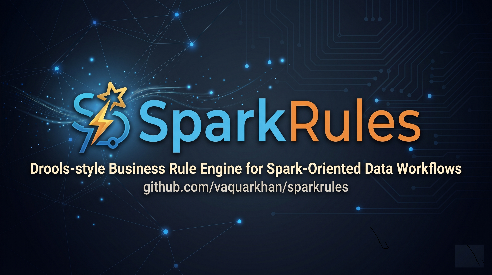
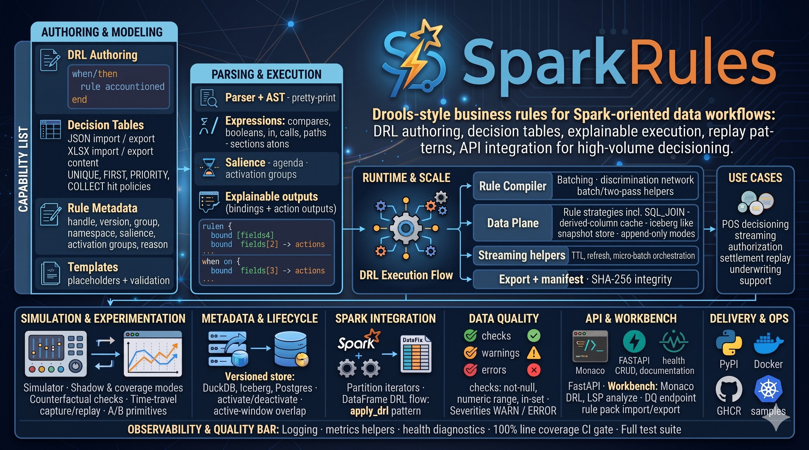

# sparkrules

**The business rule engine that Python was missing.** Drools-style DRL syntax, explainable decisions, regulatory-grade audit trails  -  from laptop to lakehouse, no JVM required.

<p align="center">
  <a href="https://pypi.org/project/sparkrules/"></a>
  <a href="https://pypi.org/project/sparkrules/"></a>
  <a href="https://github.com/vaquarkhan/sparkrules/actions/workflows/ci.yml"></a>
  <a href="https://github.com/vaquarkhan/sparkrules/actions/workflows/docker-publish.yml"></a>
  <a href="https://github.com/vaquarkhan/sparkrules/blob/main/LICENSE"></a>
  <a href="https://sparkrules.readthedocs.io"></a>
  <a href="https://github.com/vaquarkhan/sparkrules"></a>
</p>

<p align="center">
  
</p>

```python
from sparkrules.executor import RuleExecutor

result = RuleExecutor().run(
    {"amount": 1500, "region": "US"},
    'rule "high-value" when $f : Fact( amount > 1000 ) then result.risk = "high"; end',
)
print(result.fired)          # True
print(result.action_output)  # {'risk': 'high'}
```

## Install

```bash
pip install sparkrules          # core engine only
pip install sparkrules[api]     # + FastAPI server and Workbench UI
pip install sparkrules[spark]   # + PySpark cluster integration
pip install sparkrules[all]     # everything
```

---

## Who is this for?

| If you are... | SparkRules gives you... |
|---------------|------------------------|
| **Migrating from Drools** | Same DRL syntax, no JVM, Python-native  -  drop your `.drl` files in and go |
| **Building a decisioning service** | FastAPI server + browser Workbench + versioned rules in one package |
| **Running rules on Spark** | `apply_drl(df, drl)` distributes evaluation across your cluster  -  same rules, distributed execution |
| **In a regulated industry** | Adverse-action reason aggregation (ECOA/FCRA/GDPR Art 22), audit trails, deterministic replay |
| **Tired of if/else chains** | Externalized business logic that business analysts can read, version, and govern |

## Why SparkRules over alternatives?

| | SparkRules | Drools (JVM) | Custom if/else | Great Expectations |
|---|---|---|---|---|
| **Language** | Python | Java/Kotlin | Any | Python |
| **DRL rules** | ✅ | ✅ | ❌ | ❌ |
| **Decision tables** | ✅ | ✅ | ❌ | ❌ |
| **Explainable outputs** | ✅ bound fields + reason codes | ✅ | Manual | ❌ |
| **Rule governance** | ✅ versioning, promotion, deprecation | Partial (KIE) | ❌ | ❌ |
| **Data quality** | ✅ built-in + profiling | ❌ | ❌ | ✅ (DQ only) |
| **Adverse-action notices** | ✅ ECOA/FCRA/GDPR | ❌ | Manual | ❌ |
| **Spark integration** | ✅ optional | ❌ | Manual | ❌ |
| **Browser Workbench** | ✅ Monaco + LSP | ✅ (Business Central) | ❌ | ❌ |
| **Infrastructure** | `pip install` | JVM + app server | N/A | `pip install` |

**SparkRules' unique position:** governance + DQ + business rules + adverse-action reasons in one versioned, auditable package  -  from laptop to lakehouse.

---

## What's inside

### Rule engine
Write rules in Drools-style DRL. Evaluate facts. Get explainable results with bound fields, action outputs, and reason codes. Supports salience priority, agenda groups, activation groups, and multi-pattern rules.

### Decision tables
Define rules as spreadsheet-style tables with hit policies (UNIQUE, FIRST, PRIORITY, COLLECT). Import/export XLSX. Business analysts can author rules without writing DRL.

### Regulatory compliance (new in 1.0.1)
`build_adverse_action_notice()` aggregates reason codes from rule evaluations into structured notices for ECOA/FCRA (US) and GDPR Article 22 (EU). Up to 4 principal reasons per ECOA standard, deduplicated and priority-ordered.

```python
from sparkrules.executor import RuleExecutor, build_adverse_action_notice

results = [executor.run(applicant, drl) for drl in credit_rules]
notice = build_adverse_action_notice(results, decision="decline", fact_id="app-123")
# notice.principal_reasons = ("CR001", "CR002", "IN001")
```

### Data quality + profiling (new in 1.0.1)
Built-in DQ checks (not-null, range, in-set, regex, uniqueness, freshness) plus statistical profiling  -  completeness, uniqueness, mean/stddev/percentiles, top-N values. Run DQ checks before rules, governed by the same versioning and namespace system.

```python
from sparkrules.dq import profile_rows

profile = profile_rows(batch_of_facts)
# profile.fields[0].completeness = 0.98
# profile.fields[0].numeric_stats.mean = 45000.0
```

### API + Rules Workbench
FastAPI server with OpenAPI docs, health endpoint, rule CRUD, and a browser-based **Rules Workbench** with Monaco DRL editor, real-time LSP diagnostics, simulation, and interactive Chart.js dashboards.

### Simulation modes
Test rules before deploying: default, shadow (compare two rule sets), coverage (which rules fire?), counterfactual (what-if analysis), and chain (ordered multi-rule evaluation with stop-on-fire).

### DMN (minimal Camunda-style decision tables)
Evaluate a small DMN 1.3 XML subset (decision tables with hit policies including COLLECT variants) without the JVM.

- **HTTP:** `POST /dmn/evaluate` and `POST /dmn/counterfactual` (XML plus JSON environment; see OpenAPI when the API is running).
- **CLI:** `sparkrules-cli dmn-evaluate` and `sparkrules-cli dmn-counterfactual` (in-process, no server).
- **Python:** `sparkrules.dmn.evaluate_dmn_decision_table_xml` / `counterfactual_dmn_decision_table_xml`, or `SreClient.dmn_evaluate` / `dmn_counterfactual` over HTTP.

**In-process simulation CLI (same behavior as HTTP chain/shadow/coverage):** `sparkrules-cli simulate-chain`, `sparkrules-cli simulate-shadow`, and `sparkrules-cli simulate-coverage` (see `sparkrules-cli --help` for flags). Over HTTP, use `SreClient.simulate_chain`, `simulate_shadow`, and `simulate_coverage`.

### AI, Ranger, and compliance notice templates
- **AI:** By default the API uses offline structural suggestions (no generative model). For OpenAI-compatible Chat Completions, set `SPARKRULES_AI_PROVIDER=openai` and `SPARKRULES_OPENAI_API_KEY` on the server (optional: `SPARKRULES_OPENAI_BASE_URL`, `SPARKRULES_OPENAI_MODEL`, `SPARKRULES_OPENAI_TIMEOUT_SECONDS`).
- **Ranger-style HTTP policy:** When `SPARKRULES_RANGER_BASE_URL` is set, `ranger_allow_stub()` delegates to `query_ranger_allowed()` (optional `SPARKRULES_RANGER_EVAL_PATH`, `SPARKRULES_RANGER_RESULT_FIELD`). Without it, the function keeps the local dev behavior (deny empty user; otherwise allow).
- **Adverse-action (compliance):** `build_adverse_action_notice()` emits jurisdiction-framed templates for legal review; use `appendix_lines=...` for institution-specific paragraphs.

### Time-travel debug
Capture rule execution snapshots. Replay them later with different facts. Deterministic re-runs for audit and debugging.

### Governance
Version every rule. Scope by namespace. Promote through dev → stage → prod. Deprecate with propose → approve → enforce workflow. Full audit trail.

### Spark integration (optional)
Pure Python by default. When you need cluster scale, wire `apply_drl(df, drl)` into your PySpark job  -  same rules, distributed via `mapPartitions`. Compatible with Spark 3.x+. Deploy on AWS Glue, Databricks, GCP Dataproc, Azure Synapse, or Kubernetes  -  config-driven, no code changes.

### Performance (new in 1.0.1)
DRL parse caching (LRU 256) gives 5-10x throughput boost on repeated evaluations.

| Scenario | Throughput |
|----------|-----------|
| Raw `evaluate_rule` | ~199,000 evals/sec |
| 10-rule chain | ~12,000 chains/sec |
| Spark `apply_drl` local[4] | ~16,000 rows/sec |

---

## Quick start

### From PyPI
```bash
pip install sparkrules[api]
python -m uvicorn sparkrules.api.app:create_app --factory --port 8042
# → http://127.0.0.1:8042/workbench/
```

### From source
```bash
git clone https://github.com/vaquarkhan/sparkrules.git
cd sparkrules
pip install -e ".[test]"
pytest tests/ -q
```

### Docker
```bash
docker compose up --build
# → http://127.0.0.1:8042/workbench/
```

---

## Use cases

| Domain | Scenario | What SparkRules does |
|--------|----------|---------------------|
| **Lending** | Loan underwriting | Evaluate credit rules, generate adverse-action notices for declines |
| **Payments** | POS end-of-day | Batch-evaluate transaction rules, flag exceptions |
| **Insurance** | Claims adjudication | Decision tables for coverage determination |
| **Healthcare** | Clinical trial eligibility | Screen patients against inclusion/exclusion criteria |
| **Fraud** | Transaction authorization | Real-time rule evaluation with explainable decline reasons |
| **Compliance** | Settlement replay | Deterministic re-run of historical decisions for audit |

5 complete end-to-end examples with DRL, sample data, and Spark jobs: [examples/usecases/](examples/usecases/README.md)

### Jupyter notebooks

| # | Notebook | What you'll learn |
|---|----------|-------------------|
| 01 | [Getting Started](examples/notebooks/01_getting_started.ipynb) | DRL rules, evaluation, explainable results, rule chains |
| 02 | [Decision Tables](examples/notebooks/02_decision_tables.ipynb) | Hit policies, XLSX-style tables, JSON export |
| 03 | [API & Simulation](examples/notebooks/03_api_simulation.ipynb) | REST API, validate, simulate, counterfactual, LSP |
| 04 | [Credit Underwriting](examples/notebooks/04_credit_underwriting.ipynb) | Lending pipeline, adverse-action notices, data profiling |
| 05 | [Fraud Detection](examples/notebooks/05_fraud_detection.ipynb) | Real-time auth, risk scoring, OPA Rego export |
| 06 | [How SparkRules Works](examples/notebooks/06_how_sparkrules_works.ipynb) | Architecture tutorial: parsing, compilation, alpha network, governance |

Start with **notebook 06** for the architecture overview, then **01** for hands-on basics.

---

## Platform support

| Platform | How | Docs |
|----------|-----|------|
| **Local / CI** | `pip install sparkrules` | This README |
| **Docker** | `docker compose up --build` | [Dockerfile](Dockerfile) |
| **Kubernetes** | Helm-ready manifests | [deploy/k8s/](deploy/k8s/) |
| **AWS Glue** | Config-driven | [deploy/aws-glue/](deploy/aws-glue/) |
| **Databricks** | Config-driven | [deploy/databricks/](deploy/databricks/) |
| **GCP Dataproc** | Config-driven | [deploy/gcp-dataproc/](deploy/gcp-dataproc/) |
| **Azure Synapse** | Config-driven | [deploy/azure-synapse/](deploy/azure-synapse/) |

## How it works



1. **Author** rules in DRL or decision-table form
2. **Parse and validate** with LSP diagnostics
3. **Simulate** with shadow, counterfactual, and chain modes
4. **Deploy** with versioning, namespace scoping, and promotion pins
5. **Evaluate** facts and get explainable, auditable results
6. **Replay** any historical decision deterministically

## Documentation

**Full docs: [sparkrules.readthedocs.io](https://sparkrules.readthedocs.io)**

| Topic | Link |
|-------|------|
| Full feature list | [docs/FEATURES.md](docs/FEATURES.md) |
| Architecture | [docs/HOW_IT_WORKS.md](docs/HOW_IT_WORKS.md) |
| Developer guide | [docs/DEVELOPER_GUIDE.md](docs/DEVELOPER_GUIDE.md) |
| Use cases | [docs/USE_CASES.md](docs/USE_CASES.md) |
| Spark integration | [docs/SPARK_INTEGRATION.md](docs/SPARK_INTEGRATION.md) |
| Governance | [docs/GOVERNANCE.md](docs/GOVERNANCE.md) |
| Benchmarks | [docs/BENCHMARKS.md](docs/BENCHMARKS.md) |
| Architecture scope | [docs/KNOWN_LIMITATIONS.md](docs/KNOWN_LIMITATIONS.md) |
| Roadmap | [docs/ROADMAP.md](docs/ROADMAP.md) |
| Publishing / CI | [docs/PUBLISHING.md](docs/PUBLISHING.md) |
| Changelog | [CHANGELOG.md](CHANGELOG.md) |
| Contributing | [CONTRIBUTING.md](CONTRIBUTING.md) |
| Jupyter notebooks (6) | [examples/notebooks/](examples/notebooks/README.md) |
| AI agent guide | [AGENTS.md](AGENTS.md) |

## Quality

- **840+ tests**  -  unit, property-based (Hypothesis), integration, cross-path equivalence, performance
- **100% line coverage** enforced in CI (`fail_under=100`)
- **Python 3.11 / 3.12 / 3.13** tested in CI matrix
- **Ruff** lint + format enforced
- **pip-audit** dependency security scanning
- **Apache 2.0** license  -  use it anywhere, commercially or otherwise

## License

Licensed under the [Apache License, Version 2.0](LICENSE).

Copyright 2026 Vaquar Khan. See [CITATION.cff](CITATION.cff) for citation details.
