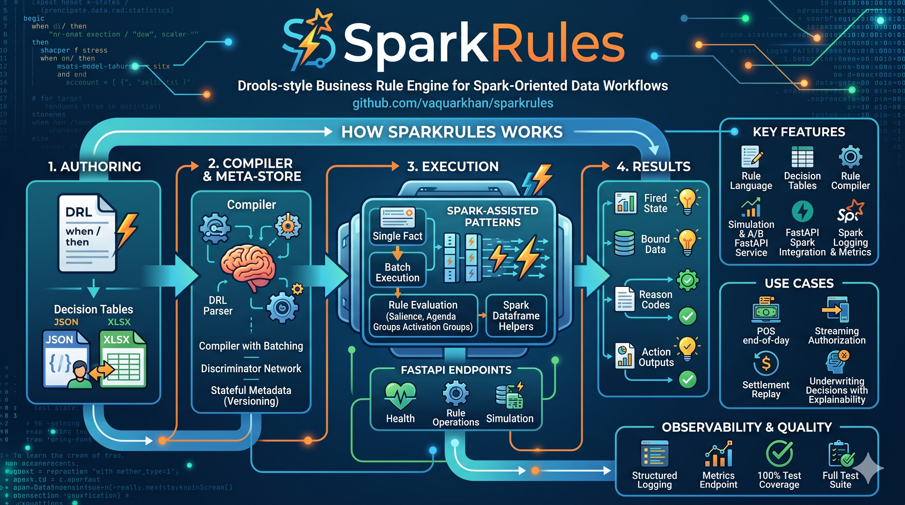

# sparkrules

<p align="center">
  <a href="https://pypi.org/project/sparkrules/"></a>
  <a href="https://pypi.org/project/sparkrules/"></a>
  <a href="https://github.com/vaquarkhan/sparkrules/actions/workflows/pypi-release.yml"></a>
  <a href="https://github.com/vaquarkhan/sparkrules/actions/workflows/docker-publish.yml"></a>
  <a href="https://github.com/vaquarkhan/sparkrules/pkgs/container/sparkrules"></a>
</p>

<p align="center">
  <a href="docs/images/sparkrules-logo.png">
    
  </a>
</p>

SparkRules is a Drools-style business rule engine for Spark-oriented data workflows. It supports DRL authoring, decision-table authoring, explainable execution, deterministic replay patterns, and API integration for high-volume decisioning services.

Repository: https://github.com/vaquarkhan/sparkrules

## Feature catalog

### Rule authoring and modeling

- DRL-style `when` / `then` rule language
- Rule metadata: handle, version, group, **namespace** (Phase 4), salience, activation group, reason codes
- Rule template support with placeholder substitution and validation
- Decision table model with hit policies: `UNIQUE`, `FIRST`, `PRIORITY`, `COLLECT`
- Decision table JSON import/export helpers
- XLSX decision-table import
- XLSX decision-table export

### Parsing and execution semantics

- Parser and AST model for rule source
- Pretty-printer for normalized DRL output
- Expression support: comparisons, boolean logic, list membership, function calls, field paths
- Execution controls: salience ordering, agenda controls, activation-group behavior
- Explainable execution outputs (bound fields and action outputs)

### Compiler and runtime primitives

- Rule strategy classification (including `SQL_JOIN` for multi-pattern rules; **local** execution can expand list-valued **bindings** in a **Cartesian** join and pick a single fire; distributed Spark path remains configuration-dependent)
- Rule batching support
- Discrimination network structures
- Batch and two-pass runtime helper modules
- Streaming helper primitives (refresh and TTL checks)
- Streaming orchestration helper for micro-batch rule refresh
- Derived-column cache utility
- Iceberg-like snapshot store for deterministic replay/testing workflows; **append-only** option for certain internal tables
- Export service with manifest and SHA-256 integrity hash
- Output sink abstraction with format targets: `iceberg`, `delta`, `hudi`, `parquet`
- Input source contract validation for batch/stream profiles
- Zero-code-change configuration contract validation
- Spark target version normalization and validation (`3`, `3.x`, `3.x.y`)
- Platform switch by configuration only: `local`, `glue`, `databricks`, `gcp-dataproc`, `azure-synapse`
- Executor sizing controls: cores, workers, memory, Glue DPU
- Performance harness and scale evidence estimators
- UDF registry with version resolution and replay-time pinning semantics
- Guided template field schema generation for authoring surfaces

### Metadata store and lifecycle

- In-memory versioned metadata store
- Pluggable metadata backends: `in_memory`, `duckdb`, `iceberg`, `postgres`
- Active-window overlap detection
- Rule activation/deactivation
- Soft delete behavior
- Version listing and time-based resolution
- Active-set hashing

### Simulation and experimentation

- Rule simulator for pre-deployment checks (`/simulations`)
- **Shadow** and **coverage** simulation modes (`/simulations/shadow`, `/simulations/coverage`)
- **Counterfactual** checks (`/simulations/counterfactual`)
- **Rule chain** dry-run: ordered DRLs with `stop_on_fire`, agenda, activation groups (`/simulations/chain`)
- **Time-travel debug** capture and replay of run snapshots (`/debug/time-travel/capture`, `/debug/time-travel/replay`); `debug_runs` table with append-only semantics in the in-process store
- Replay helper module (service-level version check)
- A/B assignment primitives

### Spark and data-plane integration

- Spark partition iterators for rule-row evaluation
- DataFrame helper for DRL application flow
- Session row helper utilities

### API and connectivity

- FastAPI app factory, OpenAPI at `/docs`
- Health endpoint
- **Rules:** create, list handles, **assets** (search, group, namespace filters), **rule pack** export/import, two-version **diff**, **`PATCH` per-version active/inactive**
- **Governance (Phase 4):** dev/stage/prod **pins** (sync, promote); **deprecation** workflow: propose, approve, list, and **enforce** to deactivate active rule versions — [GOVERNANCE.md](docs/GOVERNANCE.md)
- **Workbench** (`/workbench`): static UI with a **Monaco** DRL editor; **Validate** calls `/rules/validate` then `/ide/lsp/analyze` (diagnostics in the editor), **LSP analyze** and Ctrl+Space completions use the same LSP API
- Simulation endpoint, engine **deployment** readout, **template / guided fields** for Workbench
- Data-quality evaluation endpoint (`/dq/evaluate`)
- Optional **`SPARKRULES_API_KEY`**: mutating methods + **sensitive rule/governance `GET`s** (see [API run](#api-run))
- Lightweight **Python** client (`SreClient`): validate, simulate, counterfactual, time-travel capture/replay, governance deprecation **enforce**; **`sre-cli`**: `validate`, `simulate`, `lsp-check`, `counterfactual-check`, `chaos-check`, `health` — in-process connect server dispatch module

### Data quality

- DQ severity model (`WARN`, `ERROR`)
- DQ checks:
  - not-null
  - numeric range (between)
  - in-set
- API check parsing and validation
- Violation generation with code, field, message, and severity

### Observability

- Logging helper functions
- Metrics endpoint helpers
- Runtime health diagnostics for UI payloads
- Automatic issue flags for slow stages, high shuffle, and failed tasks

### Quality and reliability

- Unit tests
- Property tests
- Integration tests
- Optional perf tests
- **100% line coverage** on `src/sre` (enforced with `pytest tests/unit/ --cov=src/sre` and `fail_under=100` in `pyproject.toml`)

## How it works



1. Author rules in DRL or decision-table form.
2. Parse and validate rule source.
3. Compile/evaluate rules against fact payloads.
4. Return explainable outputs and runtime metadata.
5. Use replay and store versioning semantics for deterministic re-runs.

Read architecture details: [docs/HOW_IT_WORKS.md](docs/HOW_IT_WORKS.md)

## Use cases

- POS end-of-day decisioning
- Streaming authorization logic
- Settlement replay and correction
- Underwriting decision support

Details: [docs/USE_CASES.md](docs/USE_CASES.md)

## Quick start

```bash
git clone https://github.com/vaquarkhan/sparkrules.git
cd sparkrules
python -m pip install -e ".[test]"
python -c "import sre; print('ok', sre.__version__)"
pytest tests/ -q
```

Use the same interpreter for install and run commands.

## API run

**Windows (easiest):** double‑click `scripts\\dev_server.cmd` or run it from a terminal. By default the server uses **port 8042** (avoids clashes with other tools on 8000). Set `SPARKRULES_PORT=9000` before running the script to use another port.

**Any OS:**

```bash
python -m pip install -e "."
python -m uvicorn sre.api.app:create_app --factory --host 127.0.0.1 --port 8042
```

Open http://127.0.0.1:8042/docs

#### If the browser shows ERR_CONNECTION_REFUSED

1. **Start the server** and leave the terminal open (`scripts\dev_server.cmd` on Windows, or `uvicorn` as above).
2. **Match the port** in the URL to the port the process prints (default **8042** unless you set `SPARKRULES_PORT` or a different `--port`).
3. Use **`http://`**, not `https://`, for local dev unless you use a reverse proxy.
4. Run **`scripts\check_env.cmd`** from the repo: it runs `import sre` and prints `sys.executable` so you can confirm the same Python you use for **`python -m pip install -e .`**. If that import fails, install into that interpreter; if it passes but the server still fails, you are almost certainly using a **different** `python` to start Uvicorn than the one you installed into.
5. **Docker:** use the **host** port you mapped (e.g. `8042` with `-p 8042:8000`), not the container’s internal 8000, in the browser.

**API key (`SPARKRULES_API_KEY`):** when set, the same key must be sent as **`X-API-Key`** or **`Authorization: Bearer …`** for **`POST`/`PUT`/`PATCH`/`DELETE`**, and for **sensitive `GET`/`HEAD`** routes: `/rules` and under `/rules/…` (list, assets, diff, export, etc.), `/system/deployment`, and `/governance/…`. **Public without key:** `GET /health`, OpenAPI static routes (`/docs`, `/openapi.json`, …), `OPTIONS` (CORS preflight), and the Workbench static shell under `/workbench/…` (the UI still uses your key for API `fetch` calls). **OIDC** for browser SSO is not implemented; use a reverse proxy or network policy if you need that. The Workbench can store the API key in the browser (header bar) for both reads and writes.

## Rules Workbench (browser UI)

Drools Workbench–style **authoring and operations shell** (rule asset list, DRL **Monaco** editor, validate + **LSP** diagnostics, simulation, engine/deployment readout, template helper):

- http://127.0.0.1:8042/workbench/ (or the port you set in `SPARKRULES_PORT`)

The UI calls the same REST API (`/rules`, `/rules/validate`, `/ide/lsp/analyze`, `/simulations`, `/system/deployment`, etc.).

**Phase 3–4:** search/filter assets, **Overview** (stats + bar charts), light/dark **theme**, per-version **Activate / Deactivate** (`PATCH` API), rule pack, diff, optional API key, **namespace** and **dev→stage→prod** promotion pins, **governance** deprecations in the API (see [docs/GOVERNANCE.md](docs/GOVERNANCE.md)). See [docs/ROADMAP.md](docs/ROADMAP.md).

## Docker

**Local (build from this repo):**

```bash
docker compose up --build
```

Then open http://127.0.0.1:8000/workbench/ and http://127.0.0.1:8000/docs (compose maps **8042 → 8000**; the Dockerfile exposes **8000** internally.)

**CI images:** pushes to `main` / `master` / `phase-2` and tags `v*` run **GitHub Actions** and publish to **GitHub Container Registry** (`ghcr.io/<user>/sparkrules`). See [docs/PUBLISHING.md](docs/PUBLISHING.md#docker-github-container-registry).

## Cloud deploy notes

High-level platform steps (Glue, Databricks, Dataproc, Synapse) and example JSON: [deploy/README.md](deploy/README.md).

## Documentation

| Topic | Link |
|------|------|
| Features and capability matrix | [docs/FEATURES.md](docs/FEATURES.md) |
| How the system works | [docs/HOW_IT_WORKS.md](docs/HOW_IT_WORKS.md) |
| Developer guide | [docs/DEVELOPER_GUIDE.md](docs/DEVELOPER_GUIDE.md) |
| Use cases | [docs/USE_CASES.md](docs/USE_CASES.md) |
| Scale and benchmarks (methodology) | [docs/BENCHMARKS.md](docs/BENCHMARKS.md) |
| Examples | [examples/README.md](examples/README.md) |
| Contributing | [CONTRIBUTING.md](CONTRIBUTING.md) |
| Citation metadata | [CITATION.cff](CITATION.cff) |
| Roadmap (Phase 3 / 4) | [docs/ROADMAP.md](docs/ROADMAP.md) |
| Known limitations vs enterprise blueprint | [docs/KNOWN_LIMITATIONS.md](docs/KNOWN_LIMITATIONS.md) |
| PyPI / release artifacts | [docs/PUBLISHING.md](docs/PUBLISHING.md) |
| Governance (Phase 4) | [docs/GOVERNANCE.md](docs/GOVERNANCE.md) |

## License

SparkRules Non-Commercial Citation License 1.0.

- Citation is mandatory for use and redistribution.
- Commercial publishing/sale is not permitted without prior written permission.
- Full terms: [LICENSE](LICENSE)
