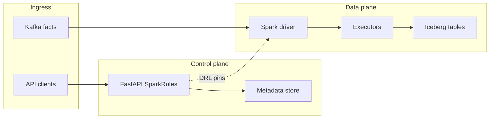

# Threat model (STRIDE) — SparkRules enterprise deployment

**Scope**: FastAPI workbench, metadata store, Spark drivers/executors, Kafka ingress, Iceberg/Delta sinks, CI/CD, operator workstations.

**Out of scope**: Generic cloud IAM (documented only as control references).

## Spoofing (S)

| Threat | Mitigation |
|---------|------------|
| Fake `X-Principal` / `X-Tenant-Id` headers | Disable header trust in prod; use **OIDC** (`SPARKRULES_AUTH_MODE=oidc`) or **mTLS** with verified client cert subject mapping |
| Spoofed Kafka clients | Mutual TLS or SASL/OAUTHBEARER on brokers; ACL by principal |

## Tampering (T)

| Threat | Mitigation |
|---------|------------|
| DRL tampered in transit | TLS everywhere; sign DRL blobs (**Sigstore** / GPG) at promotion; verify before `refresh_rules` |
| Metadata store corruption | Postgres row-level security + least-privilege DB role; backups + PITR |
| Mutable rule artifacts on object storage | **Object immutability** + version IDs; deny `s3:DeleteObject` on prod prefixes |

## Repudiation (R)

| Threat | Mitigation |
|---------|------------|
| Operator denies promotion | Append-only **audit** log (`/audit/logs`) with request hash; central SIEM forwarding |
| Spark job denies scoring path | Spark event logs + OpenLineage (optional) |

## Information disclosure (I)

| Threat | Mitigation |
|---------|------------|
| `/metrics` leaks cluster topology | NetworkPolicy: scrape only from Prometheus namespace; auth on scrape if supported |
| `/rules` exports sensitive logic | Role `rule_reader` only on need-to-know; separate **obfuscated** packs for vendors if required |
| Executor heap dumps | Disable heap dumps in prod; encrypt ephemeral disks |

## Denial of service (D)

| Threat | Mitigation |
|---------|------------|
| Oversized DRL (`RULEPACK_TOO_LARGE`) | Already enforced; tune bytes per tenant |
| API flooding | Rate limit at ingress (Envoy / API gateway); body size caps |
| Expensive Spark plans | RulePack classification favors **SQL_PUSHDOWN**; quotas per tenant job |

## Elevation of privilege (E)

| Threat | Mitigation |
|---------|------------|
| `platform_admin` overreach | Break-glass accounts; MFA; quarterly access review |
| Spark UDF injection | Only allow registered UDFs from `UserDefinedFunctionRegistry`; no `eval` of user strings |

## Data-flow diagram (simplified)

Review this model when adding **Feast**, **OPA**, or **LLM** providers (new trust anchors).
